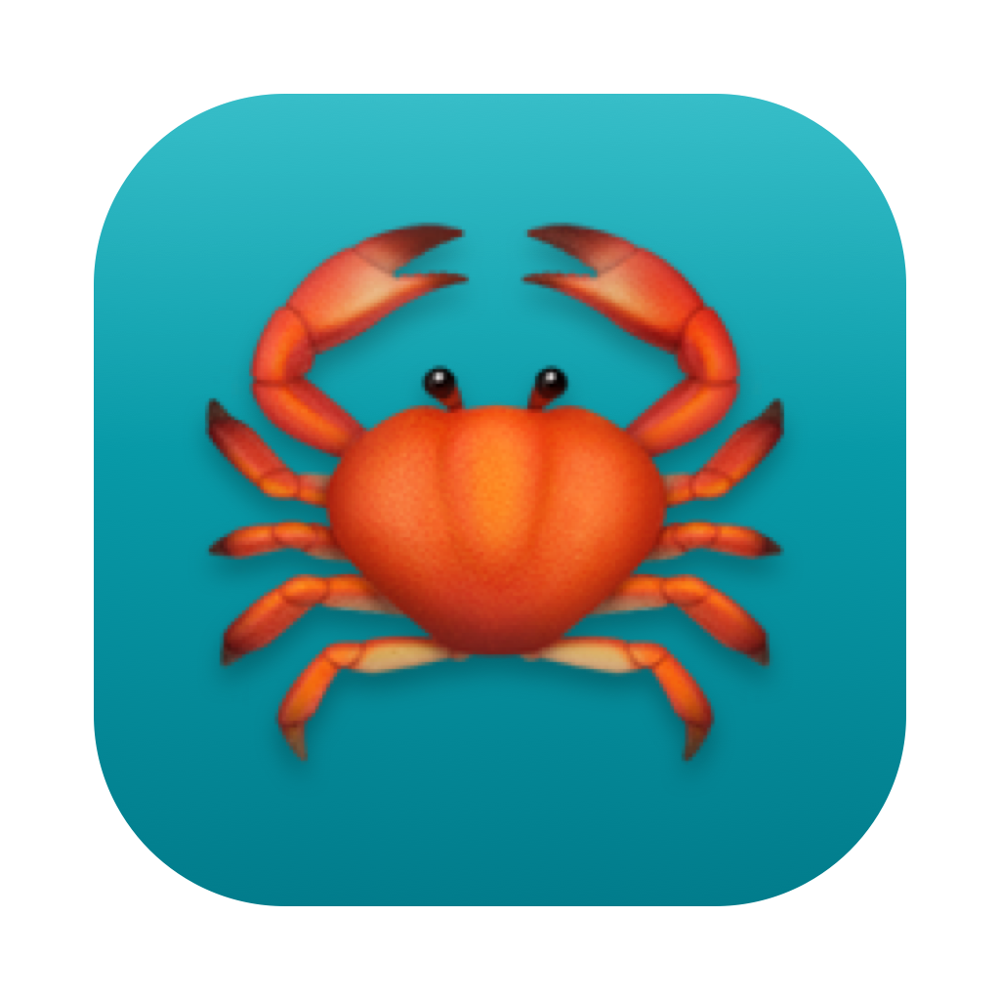

# Crab Bot Manager (macOS)




一个原生 SwiftUI 的本地控制面板，用来管理这台 Mac 上跑的多个机器人实例——查看状态、启动/停止/重启、看日志、给 ClawBot 扫码登录。

它**不是**新的机器人运行时，而是套在现有 Node/Python 运行时之上的操作面板：
进程仍由 launchd 托管，App 复用 `tools/launchd_ctl.sh` 与 `launchctl`。

## 能做什么

- **机器人列表**：自动发现固定服务（飞书 ×2、微信客服、cloudflared）和 `config/clawbot/*.json` 里的所有 ClawBot 账号
- **实时状态**：每 4 秒刷新一次，绿点=运行中 / 橙点=已加载未运行 / 灰点=未安装；显示 PID、上次退出码
- **生命周期**：单实例 启动 / 停止 / 重启；侧边栏一键 安装全部 / 卸载全部
- **新建 / 删除 ClawBot 账号**：工具栏「＋」新建账号（填名字、选 Claude/Codex 引擎，codex 再填工作目录），自动写 `config/clawbot/<名字>.json`（codex 同时生成默认人设 CODEX.md）并注册成 launchd 服务，建完直接在详情页扫码；详情页或侧边栏右键「删除账号」会停服务、删 plist、删配置与登录状态目录（只动这一个账号，不影响其它）
- **日志查看**：每 3 秒刷新各实例日志末尾 200 行（`~/Library/Logs/cmr/cmr.<name>.log`）
- **ClawBot 扫码**：自动从该实例日志的 `CLAWBOT_LOGIN_QR` 提取二维码并渲染，用微信扫码即可登录该实例
- **禁止访问的文件夹（沙箱）**：在「设置」里加入文件夹，机器人进程会被内核级 seatbelt 沙箱（`sandbox-exec`）禁止读/写——连 shell 都绕不过，防止有人借机器人转发敏感文件

## 文件访问沙箱

防的是「有人通过聊天诱导机器人去读你电脑里的敏感文件再转发出去」。

- 名单存在 `config/sandbox/deny.json`（`{"denyPaths":[...]}`），App 设置页可视化编辑。
- `tools/sandbox_profile.sh gen` 据此生成 seatbelt profile（`~/Library/Application Support/cmr/sandbox/deny.sb`），自动补上 APFS firmlink 备用路径 `/System/Volumes/Data/...`。
- `tools/launchd_ctl.sh install` 时若名单非空，plist 的启动命令会变成
  `/usr/bin/sandbox-exec -f <profile> node <script> …`，内核层拒绝对名单内文件夹的一切读写。
- 在 App 里点「应用并重启全部机器人」即生效（= 写 deny.json + 重装服务）。

> 注：`sandbox-exec` 被 Apple 标为 deprecated，但当前 macOS 仍可用。追求永久支持的强隔离可改用「独立低权限 macOS 用户 + 文件 ACL」。

## 构建运行

需要 Xcode / Swift 工具链（macOS 13+）。

```bash
# 打包成可双击的 .app
./macos/build_app.sh release
open "macos/dist/Crab Bot Manager.app"

# 开发期直接跑
cd macos/BotManager && swift run

# 跑测试
cd macos/BotManager && swift test
```

`build_app.sh` 会把当前仓库根路径写进 App（`GeneratedConfig.swift`），App 据此找到
`tools/launchd_ctl.sh` 和 `config/`。也可在 App 内「设置」里改仓库路径，或设环境变量 `CMR_ROOT`。

## 架构

| 层 | 文件 | 职责 |
|---|---|---|
| 模型 | `Models/BotType.swift`、`BotRecord.swift` | 机器人类型与实例记录、派生路径 |
| 发现 + 控制 | `Services/LaunchctlService.swift` | 发现实例、解析 `launchctl print`、start/stop/restart |
| 进程 | `Services/Shell.swift` | 执行外部命令（补齐 PATH） |
| 日志/二维码 | `Services/LogService.swift`、`QRImage.swift` | 读日志尾部、提取并渲染登录二维码 |
| 路径 | `Services/RepoPaths.swift` | 解析仓库根（env → manager.json → 编译默认 → 兜底） |
| 状态 | `ViewModels/AppModel.swift` | 全局状态 + 定时刷新 |
| 界面 | `Views/*.swift` | 列表 / 详情 / 设置 |

纯逻辑（账号发现、状态解析、二维码提取、日志尾部）有单元测试覆盖（`Tests/BotManagerTests`）。

## 已知边界

- 「停止」用 `launchctl bootout` 卸载该 job（plist 仍在磁盘），「启动」再 `bootstrap` 加载回来。
- 「启动」一个从未安装过的实例时，会回退到 `launchd_ctl.sh install` 对应 scope 写入 plist。
- 暂未提供「新建机器人」的图形向导：新增 ClawBot 账号仍是在 `config/clawbot/` 放一个 `<account>.json`，App 会自动发现。
